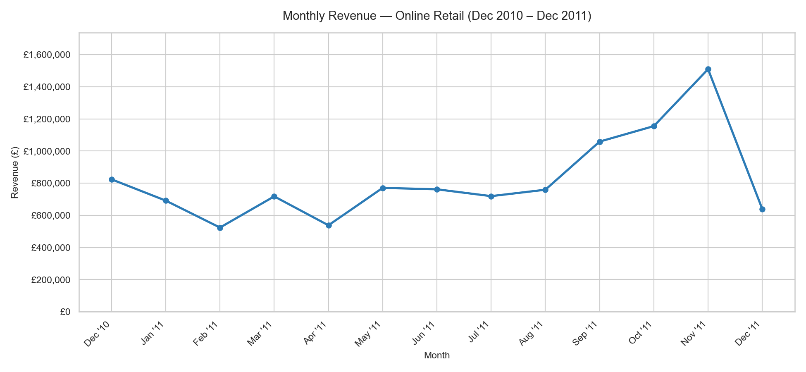
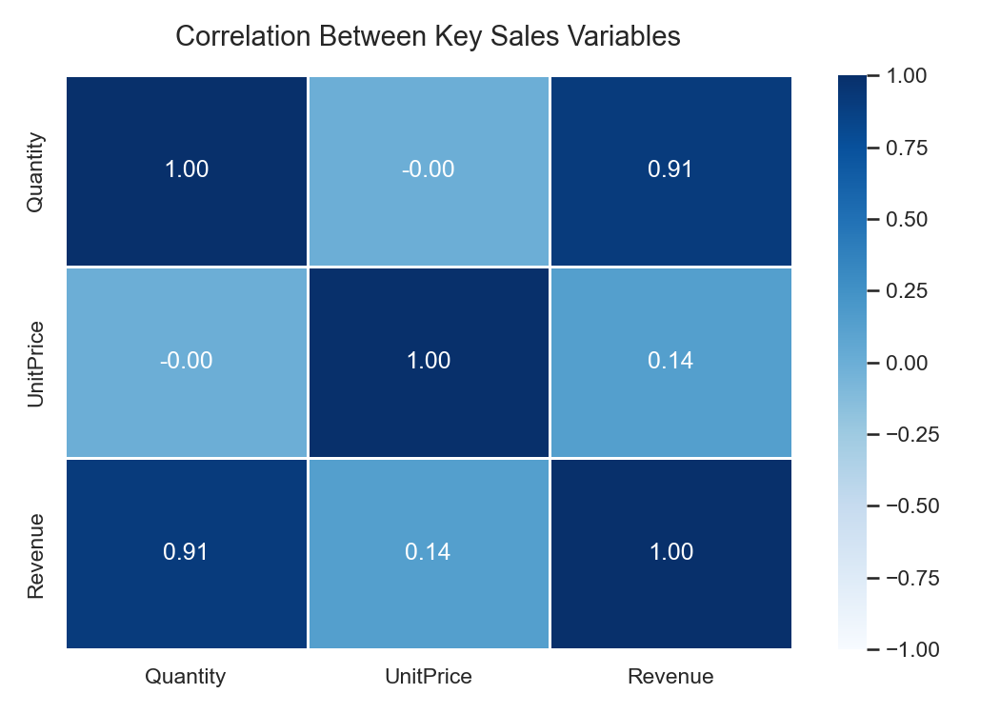

# Online Retail Revenue and Customer Trend Analysis

This is a Python-based business analytics project analyzing 12 months of real transaction data 
from a UK-based online retailer. The goal of the project was to uncover business insights around 
revenue trends, customer behavior, and geographic performance.





---

## Project Overview

This project was built to demonstrate practical data analytics skills using a real-world 
business dataset. It covers the full analytics workflow, transforming raw data, loading and cleaning 
through to visualization, insight generation, and revenue forecasting.

**Author:** Joseph Viscione  
**Tools:** Python, pandas, matplotlib, seaborn, Prophet  
**Dataset:** UCI Machine Learning Repository — Online Retail Dataset (CC BY 4.0)

---

## Key Findings

- The revenue is highly seasonal, nearly doubling in Q4 with a peak in November 2011
- The top customer alone generated over £280,000 & the top 10 customers represent a 
  disproportionate share of total revenue, posing a real concentration risk
- The UK accounts for the vast majority of revenue, with no international market coming close
- The top products are spread evenly in revenue terms, which may suggest a healthier product mix 
  than the customer or geographic concentration
- A 6-month revenue forecast using Prophet projected a continued upward trend in the 
  £1.2M to £1.6M monthly range

---

## Project Structure
```
online_retail_project/
├── data/               # Raw dataset (not included in repo)
├── notebooks/          # Main analysis notebook
├── outputs/figures/    # All saved chart outputs
├── src/                # Source files
└── README.md
```

---

## How to Run

1. Clone the repository
2. Install dependencies: `pip install -r requirements.txt`
3. Open `notebooks/online_retail_analysis.ipynb` in Jupyter Lab/notebook
4. Run all cells from top to bottom

---

## Data Source

UCI Machine Learning Repository — Online Retail Dataset  
https://archive.ics.uci.edu/dataset/352/online+retail  
License: CC BY 4.0